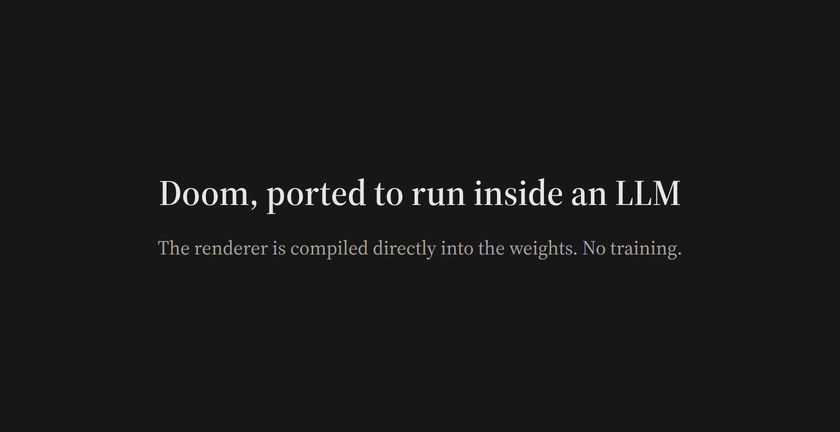

# torchwright_doom

DOOM rendering and game graph compilation, built on
[torchwright](https://github.com/physicsrob/torchwright). 

**Read the full article: [Doom, compiled into a transformer](https://ood.dev/posts/doom)**



## What this is

This package builds a **computation graph** that the `torchwright` compiler
turns into a **transformer**, which then renders DOOM **autoregressively** —
one discrete input token in, one output token out, per step, the same loop
that drives any chat model. Output tokens carry pixel information; the host
copies each output token to the next input and blits pixels to the screen
(in production the blit happens post-hoc, by the shipped decode tools).

The production artifact is a stock Hugging Face `Phi3ForCausalLM`, compiled
directly from the Doom graph into sharded fp32 safetensors. Both model and the
data-only WordLevel tokenizer (a plain `tokenizer.json` whose token words are
human-readable — no tokenizer code) load through ordinary auto classes with
no custom model/tokenizer code and no `trust_remote_code=True`. ONNX is a
diagnostic backend only (`diagnostics/`), never a render or publication input.
Canonical numbers (resolution, token counts, timings, accuracy): `FACTS.md`.

The **dumb-host principle** governs everything: all rendering logic — wall
selection, visibility, distance, texture lookup, compositing — lives inside
the transformer. During generation the host only feeds tokens and writes
pixels; it does no geometry, no sorting, and no arithmetic on the values the
model computes. Pure bitblitting.

Two boundary rules make that claim precise:

- **Input side (before generation):** the host builds the prompt — it crops
  the level file to a fixed world-space rectangle declared once in the scene
  config (view-independent; see *subset* in `GLOSSARY.md`) and encodes
  static map facts as tokens. The rule: the prompt may bake any
  **view-independent** static-scene fact; all **view-dependent** work —
  visibility, ordering, projection, occlusion — happens inside the
  transformer. This is input preparation, like loading a level file.
- **Output side (after generation):** the decode tools apply the cursor
  protocol the model itself emits — every cursor set, direction mark, and
  run width is a model output token; the host just keeps track of the cursor
  and blits.

(See `CLAUDE.md` for the principle as enforced during development.)

## Where to start

- **The graph lives in `torchwright_doom/model/`** — everything there
  compiles into the transformer; everything outside it runs on the host.
  Shared kernel modules (vocabulary, token↔residual codec, attention
  plumbing, shared math) sit flat at `model/` root; the pipeline stages are
  `model/scene/`, `model/protocol/`, `model/traversal/`, `model/raster/`,
  `model/assets/`. `model/__init__.py` has the per-module map.
- **Entry point:** `render_main.forward`
  (`torchwright_doom/model/render_main.py`) *constructs* the per-token
  forward pass — compile-time graph code, run once; the compiled
  transformer then executes it at every AR step. It builds the read side
  (decode the input token + consult static map facts), has each write-side
  protocol owner publish its channels, builds each dispatch branch's
  next-token, and selects one by the current token's type.
- **Reading path** (one `forward()` pass, read side → write side, all under
  `model/`): `vocab` / `tokens` → `embedding` / `extract` → `scene/`
  (static read side) → `protocol/` (the dispatch table) →
  `render_main.forward` (assembly) → the write side:
  `traversal/bsp_traversal` (R_RenderBSPNode) → `raster/seg_projection` →
  the `wall_*` / `visplane_*` / `flat_*` rasterizers → the pixel pass.
- **Prefill pipeline** (WAD → tokens the model reads before autoregression):
  `doom1.wad` (the freely redistributable shareware 1.9 WAD, committed at
  repo root) → `prompt/wad.py` (raw `MapData`) → `prompt/subset.py` (sliced
  to the config's fixed `region:` rectangle, renumbered, mean-centred) →
  `prompt/build.py` (`list[Token]`) → `tokenizer/rows.py` (row indices) →
  the model. Production entry: `prompt/scene.prefill_rows_for`.

## Docs

- **`FACTS.md`** — the canonical numbers (resolution, token counts,
  timings, checkpoint size, accuracy). Other surfaces quote from it.
- **`CLAUDE.md`** — full module layout, the production HF runtime, and
  the graph-debugging tool sequence.
- **`GLOSSARY.md`** — plain-English definitions of the coined vocabulary
  (carrier, head, marker, owner, subcontext, visplane, flat, …).
- **`TOKENIZATION.md`** — the row vocabulary, raw and pretty text formats,
  stock tokenizer/detokenizer, carrier folding, and worked examples.
- **`PROTOCOL.md`** — the pixel protocol: the exact per-frame token
  sequence (prefill + every AR phase), in the readable-surface token names.
- **`BSP_TRAVERSAL.md`** — how near-first BSP traversal, occlusion, and the
  attention-backed return stack determine wall order.
- **`protocol_registry.render_protocol_table()`** — the generated table of
  the token protocol (every token type, its phase, role, and dispatch
  wiring), for a top-down view of the AR protocol.

## Running

`make compile` creates the complete Phi-3 bundle on Modal (publication,
`bundle/`; "validated" there means manifest completeness plus shipped-tool
smoke checks — pixel accuracy is the separate gate below). `make run`
resolves that same bundle and executes its exact bundle-root `infer.py` on
the configured GPU (portable inference) — the only generation path in the
project. Everything after the subprocess is interpretation (`interpret/`).
`configs/e1m1.yaml` is the sole full-resolution publication configuration,
while `configs/e1m1_lowres.yaml` builds a separate 80×50 checkpoint sized for
64 GiB of total accelerator memory—one 64-GiB-class device, or two 32-GiB
consumer GPUs through `device_map="auto"`. The full 320×200 checkpoint still
needs a B200-class machine; the practical checkpoint trades resolution for a
7,007-token frame and an 8,000-token generation cap. Its full A100-80GB render
peaked at 43.48 GiB reserved, so it also fits two 32-GiB consumer GPUs through
automatic device mapping.

Published checkpoints:

- [320×200 flagship](https://huggingface.co/physicsrob/torchwright-doom-e1m1)
  — 38 layers, 85.87 GB of fp32 weight shards.
- [80×50 practical](https://huggingface.co/physicsrob/torchwright-doom-e1m1-80x50)
  — 70 layers, 34.09 GB of fp32 weight shards.

**Correctness gate:** `make run COMPARE=1` scores every rendered frame
pixel-by-pixel against the vendored plain-Python reference renderer
(`pydoom/`), reporting coverage and within-option color (see `GLOSSARY.md`)
and writing a diff PNG. The production render's scores are in `FACTS.md`.

The load path that backs the "stock transformer" claim is the ordinary
Transformers text-generation pipeline:

```python
from pathlib import Path
from transformers import pipeline

generate = pipeline("text-generation", model=bundle, device_map="auto")
prompt = Path(bundle, "examples/e1m1_prompt.txt").read_text()
generated_text = generate(prompt, return_full_text=False)[0]["generated_text"]
```

The bundle contains its executable E1M1 text prompt (`examples/e1m1_prompt.txt`)
and `infer.py` at the bundle root. That isolated script drives the same
pipeline with progress and identity checks, and is the inference program used
by production renders. It writes canonical integer row ids and their raw
standard-tokenizer text. `tools/pretty_text.py`
formats that text for reading, and `tools/txt_to_png.py` independently turns
the same text into a frame by executing the cursor protocol the model
emitted — every cursor set, direction mark, and run width in the stream is a
model output; the tool applies them plus palette lookup and last-write-wins
blitting:

```bash
python infer.py --model . --prompt examples/e1m1_prompt.txt --output out
python tools/pretty_text.py --input out/output.txt --output out/output.pretty.txt
python tools/txt_to_png.py  --input out/output.txt --output out/frame.png
```
